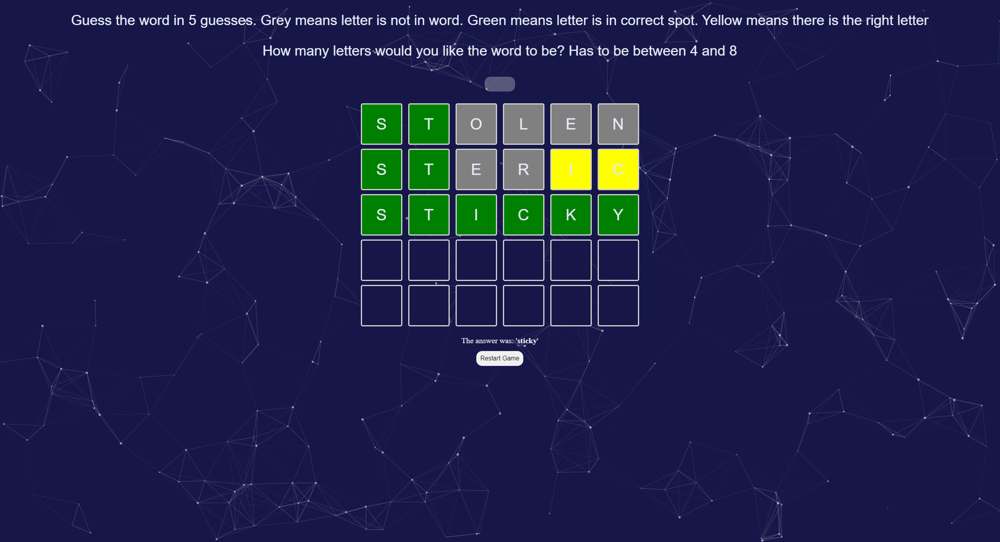

# wordle
Wordle clone with changing word length option for varying points

# How To install
 - clone this repo
 - download and install [node](https://nodejs.org/en/download)
 - in the projects directory do `npm i` to install all dependecies

 # How To Run
 - run `npm start` in the project directory

# Demo
